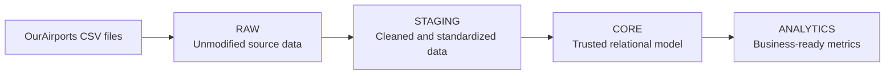

# Global Flight Data Pipeline

An end-to-end Data Engineering project that ingests, transforms, validates, and analyzes worldwide airport data from the [OurAirports](https://ourairports.com/data/) dataset.

The pipeline runs on PostgreSQL and Apache Airflow, follows a layered data architecture, and includes automated tests, data-quality gates, retries, timeouts, and monitoring callbacks.

## Architecture



The Airflow orchestration follows the same order:

```text
global_pipeline
  → raw_ingestion
  → staging_transformation
  → core_transformation
  → analytics_transformation
```

Each transformation layer includes a quality gate before the next layer is triggered.

## Tech Stack

- Python 3.12
- PostgreSQL 17
- Apache Airflow 3.3.1
- Docker and Docker Compose
- Pandas
- Psycopg2
- Pytest

## Data Source

The project uses the following OurAirports datasets:

- `airports.csv`
- `countries.csv`
- `regions.csv`
- `runways.csv`

They are stored locally under `data/raw/ourairports/` and are intentionally excluded from Git because of their size.

## Data Layers

| Layer | Purpose | Main entities |
| --- | --- | --- |
| `raw` | Stores source data with minimal changes. | airports, countries, regions, runways |
| `staging` | Cleans, standardizes, and validates source data. | airports, countries, regions, runways |
| `core` | Provides the trusted relational model. | countries, regions, airports, runways |
| `analytics` | Provides business-ready aggregate metrics. | country_stats, region_stats, airport_stats, global_summary |

## Current Dataset Metrics

| Metric | Value |
| --- | ---: |
| Countries | 249 |
| Regions | 3,984 |
| Airports | 85,884 |
| Eligible CORE runways | 48,155 |
| Global summary rows | 1 |

Three source runways do not reference a valid airport and are reported as warnings during data-quality validation. They are therefore excluded from the CORE and ANALYTICS layers.

## Project Structure

```text
.
├── config/                 # Project configuration
├── dags/                   # Airflow DAG definitions
├── data/raw/ourairports/   # Local OurAirports CSV source files
├── sql/                    # Database schemas and transformation SQL
├── src/
│   ├── ingestion/          # CSV validation and RAW ingestion
│   ├── transform/          # STAGING, CORE, and ANALYTICS transformations
│   ├── quality/            # Data-quality validations and quality runners
│   └── monitoring/         # Airflow retry and failure callbacks
├── tests/                  # Automated pytest suite
├── docker-compose.yml
├── Dockerfile
├── requirements.txt
└── README.md
```

## Prerequisites

- Docker Desktop
- Docker Compose
- Git

Optional for local commands outside Docker:

- Python 3.12
- A Python virtual environment

## Configuration

Create your local environment file from the example:

```powershell
Copy-Item .\.env.example .\.env
```

Update the values in `.env`.

For this project, PostgreSQL is exposed locally on port `5434`:

```env
POSTGRES_DB=flight_data
POSTGRES_USER=flight_user
POSTGRES_PASSWORD=your_secure_password
POSTGRES_HOST=localhost
POSTGRES_PORT=5434
```

`FLIGHT_API_KEY` is reserved for future API-based ingestion and is not required for the current OurAirports CSV pipeline.

## Start the Project

Build the Airflow image and start PostgreSQL and Airflow:

```powershell
docker compose up -d --build
```

Check the running containers:

```powershell
docker ps
```

Services:

| Service | Address |
| --- | --- |
| Airflow UI | http://localhost:8080 |
| PostgreSQL | `localhost:5434` |
| Database | `flight_data` |

## Database Initialization

The schema and tables are defined in the `sql/` directory:

| Script | Purpose |
| --- | --- |
| `001_create_schemas.sql` | Creates `raw`, `staging`, `core`, and `analytics` schemas |
| `002`–`004` | Creates RAW tables |
| `005_create_staging_tables.sql` | Creates STAGING tables |
| `006_transform_raw_to_staging.sql` | RAW → STAGING transformation |
| `007_create_core_tables.sql` | Creates CORE tables |
| `008_transform_staging_to_core.sql` | STAGING → CORE transformation |
| `009_create_analytics_tables.sql` | Creates ANALYTICS tables |
| `010_transform_core_to_analytics.sql` | CORE → ANALYTICS transformation |

## Airflow DAGs

| DAG | Schedule | Purpose |
| --- | --- | --- |
| `raw_ingestion` | Triggered by global pipeline | Loads OurAirports CSV files into RAW |
| `staging_transformation` | Triggered by global pipeline | Transforms RAW data and runs STAGING quality checks |
| `core_transformation` | Triggered by global pipeline | Transforms STAGING data and runs CORE quality checks |
| `analytics_transformation` | Triggered by global pipeline | Builds analytics tables and runs ANALYTICS quality checks |
| `global_pipeline` | Every day at 02:00 | Orchestrates the complete pipeline |

`global_pipeline` uses `max_active_runs=1` to prevent overlapping executions.

Transformation tasks use:

- 2 retries;
- 5-minute retry delay;
- execution timeouts;
- retry and failure monitoring callbacks.

Quality gates do not retry: data-quality failures must be investigated before continuing the pipeline.

## Run the Pipeline

From the Airflow UI, trigger `global_pipeline` manually.

Or use the Airflow CLI:

```powershell
docker exec -it global-flight-airflow airflow dags trigger global_pipeline
```

The full execution order is:

```text
RAW ingestion
→ STAGING transformation and quality gate
→ CORE transformation and quality gate
→ ANALYTICS transformation and quality gate
```

## Automated Tests

The project contains 53 automated tests covering:

- DAG imports;
- task structure and dependencies;
- scheduling and concurrency;
- retries, retry delays, and timeouts;
- monitoring callbacks;
- quality-gate behavior;
- transformation commits, rollbacks, and connection handling;
- global pipeline orchestration.

Run the full test suite inside the Airflow container:

```powershell
docker exec -it global-flight-airflow python -m pytest -q `
    -o cache_dir=/tmp/pytest-cache `
    /opt/airflow/project/tests
```

Expected result:

```text
53 passed
```

## Monitoring and Data Quality

Airflow callbacks log useful context for retries and failures:

- DAG ID
- task ID
- run ID
- retry number
- raised exception

Data-quality checks validate row counts, data integrity, relationships, and analytical aggregates at each transformation layer.

## Development Workflow

```powershell
git switch master
git pull origin master
git switch -c feature/your-feature-name
```

Before committing:

```powershell
docker exec -it global-flight-airflow python -m pytest -q `
    -o cache_dir=/tmp/pytest-cache `
    /opt/airflow/project/tests

git diff --check
git status
```

## Status

The local pipeline is complete and validated:

- layered PostgreSQL data model;
- full RAW → STAGING → CORE → ANALYTICS processing;
- Apache Airflow orchestration;
- daily scheduling;
- retries, timeouts, and monitoring callbacks;
- data-quality gates;
- 53 passing automated tests.

Future production-oriented improvements include external notifications, continuous integration, and cloud deployment.